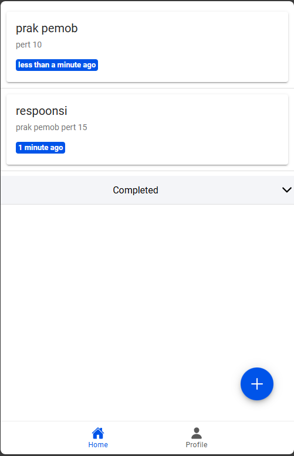
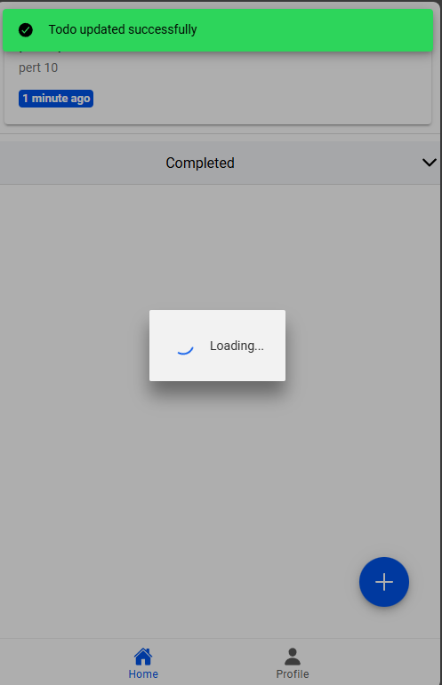
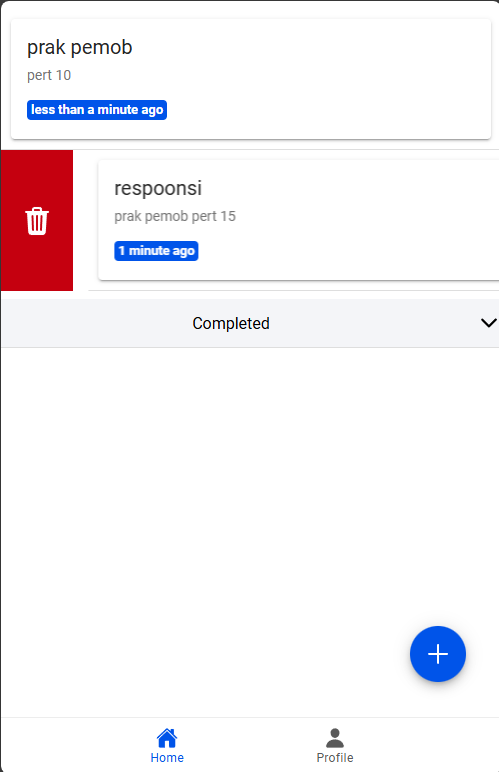
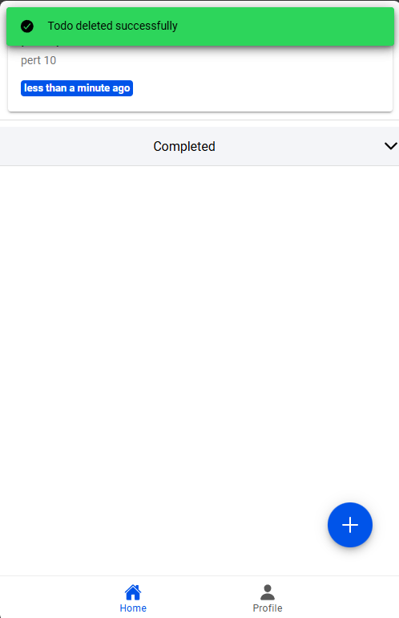

nama : Muhammad Syaiful Latif
NIM : H1D022025

1. Login dengan Google:

- Ketika tombol "Sign In with Google" diklik, fungsi loginWithGoogle dipanggil.
- Aplikasi mendeteksi platform menggunakan isPlatform('capacitor') (web atau mobile).
- Firebase menggunakan GoogleAuthProvider untuk autentikasi melalui signInWithPopup. Setelah login berhasil, data pengguna (seperti nama, email, dan foto profil) disimpan dalam objek user yang dapat diakses di seluruh aplikasi.

2. Navigasi ke Halaman Utama:

- Setelah login, aplikasi menavigasi ke halaman utama /home dengan router.push("/home").

3. Mengakses Data Pengguna:

- Data pengguna (nama dan foto) diakses melalui user.value.displayName dan user.value.photoURL.

4. Logout:

- Fungsi logout menggunakan signOut Firebase dan GoogleAuth.signOut() untuk membersihkan sesi. Setelah logout, aplikasi mengatur user menjadi null dan mengarahkan pengguna ke halaman login.

5. Menjaga Status Autentikasi:

- onAuthStateChanged digunakan untuk mendeteksi perubahan status autentikasi, memperbarui nilai user dan menyesuaikan konten aplikasi berdasarkan status login.
6. Create 

- Ketika tombol Tambah pada Floating Action Button (FAB) ditekan, modal input (InputModal) akan muncul. Pengguna dapat mengisi data todo yang terhubung dengan v-model, sehingga nilai input diperbarui secara langsung. Saat tombol Simpan ditekan, event @submit akan memanggil fungsi handleSubmit(todo).
- Di dalam fungsi handleSubmit(todo), input akan divalidasi terlebih dahulu. Jika title kosong, akan muncul pesan peringatan melalui showToast. Jika validasi berhasil, fungsi akan memeriksa apakah editingId kosong. Jika kosong, fungsi firestoreService.addTodo(todo) akan digunakan untuk menambahkan data baru ke database. Setelah itu, fungsi loadTodos() dijalankan untuk memperbarui daftar todo, diikuti dengan notifikasi keberhasilan. Proses ini memastikan penambahan todo berjalan dengan baik.

7. Edit data

- Saat pengguna ingin mengedit data, mereka dapat memilih item todo yang ada, sehingga modal input (InputModal) terbuka dengan data yang sudah terisi. Data tersebut terhubung ke modal melalui v-model, memungkinkan pengguna melihat dan mengeditnya langsung.
- Setelah selesai mengedit dan menekan tombol Simpan, event @submit akan memanggil fungsi handleSubmit(todo). Dalam fungsi ini, sistem memeriksa apakah editingId memiliki nilai. Jika ada, berarti pengguna sedang mengedit data. Fungsi firestoreService.updateTodo(editingId, todo) kemudian dipanggil untuk memperbarui data di database berdasarkan ID yang diedit.

- Setelah pembaruan berhasil, fungsi loadTodos() dijalankan untuk memperbarui daftar todo agar mencerminkan perubahan terbaru. Notifikasi keberhasilan melalui showToast akan ditampilkan, memastikan pengguna tahu bahwa data berhasil diperbarui. Alur ini memastikan proses pengeditan berjalan lancar dan perubahan tersimpan dengan baik.

8. Delete

- Proses penghapusan todo dimulai ketika pengguna memilih item yang akan dihapus lalu menekan tombol Delete. Aplikasi akan menampilkan konfirmasi, seperti melalui modal atau notifikasi, untuk memastikan tindakan tersebut. Jika pengguna mengonfirmasi, fungsi deleteTodo(todoId) dipanggil untuk menghapus data dari database (misalnya Firestore).

- Setelah berhasil, fungsi loadTodos() akan memperbarui daftar todo, sehingga item yang dihapus tidak lagi terlihat. Notifikasi keberhasilan kemudian ditampilkan untuk memberi tahu pengguna bahwa penghapusan telah berhasil. Proses ini memastikan penghapusan dilakukan dengan aman dan jelas.