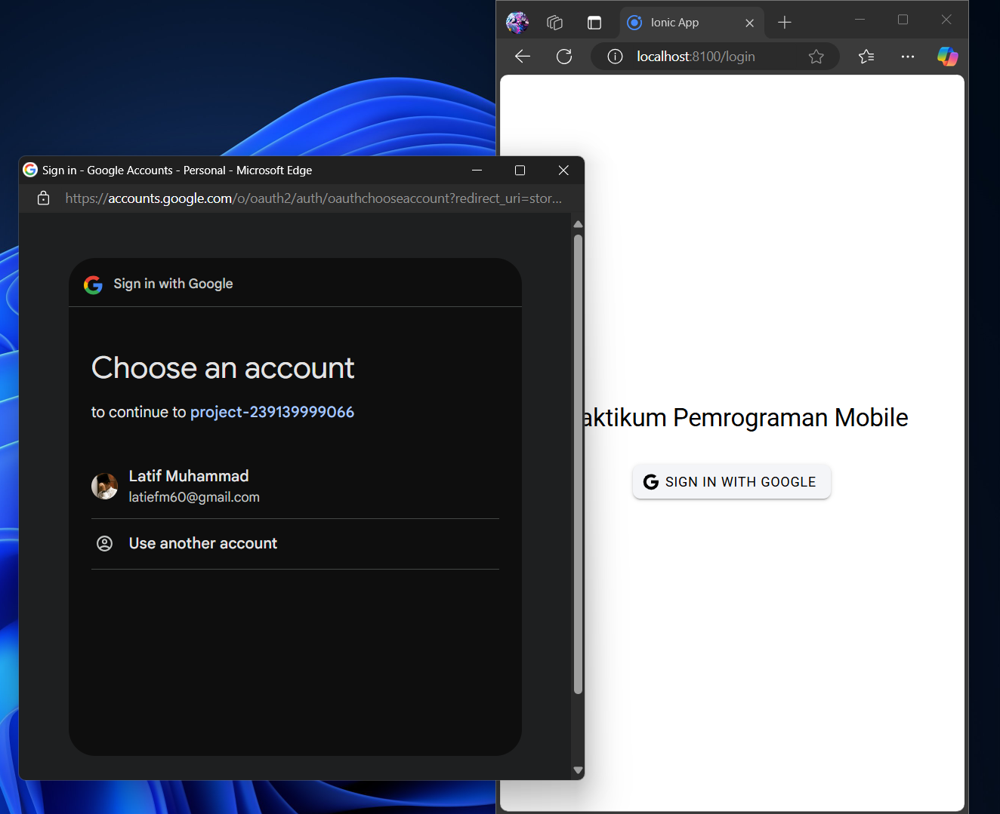

nama : Muhammad Syaiful Latif
NIM : H1D022025

1. Login dengan Google:

- Ketika tombol "Sign In with Google" diklik, fungsi loginWithGoogle dipanggil.
- Aplikasi mendeteksi platform menggunakan isPlatform('capacitor') (web atau mobile).
- Firebase menggunakan GoogleAuthProvider untuk autentikasi melalui signInWithPopup. Setelah login berhasil, data pengguna (seperti nama, email, dan foto profil) disimpan dalam objek user yang dapat diakses di seluruh aplikasi.

2. Navigasi ke Halaman Utama:

- Setelah login, aplikasi menavigasi ke halaman utama /home dengan router.push("/home").

3. Mengakses Data Pengguna:

- Data pengguna (nama dan foto) diakses melalui user.value.displayName dan user.value.photoURL.

4. Logout:

- Fungsi logout menggunakan signOut Firebase dan GoogleAuth.signOut() untuk membersihkan sesi. Setelah logout, aplikasi mengatur user menjadi null dan mengarahkan pengguna ke halaman login.

5. Menjaga Status Autentikasi:

- onAuthStateChanged digunakan untuk mendeteksi perubahan status autentikasi, memperbarui nilai user dan menyesuaikan konten aplikasi berdasarkan status login.